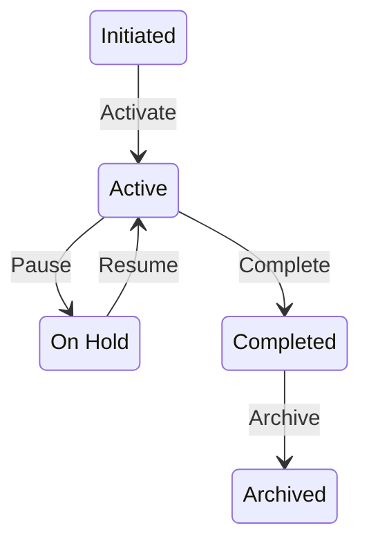

# ProjectStatus State Diagram

Auto-generated from `agentpm/core/database/enums/status.py`

## States

- **initiated**: INITIATED
- **active**: ACTIVE
- **on_hold**: ON_HOLD
- **completed**: DONE
- **archived**: ARCHIVED

## Metadata

- **Enum Class**: `ProjectStatus`
- **Total States**: 5
- **Terminal States**: Yes
- **Auto-progression**: Yes

---
*This diagram is auto-generated. Do not edit manually.*