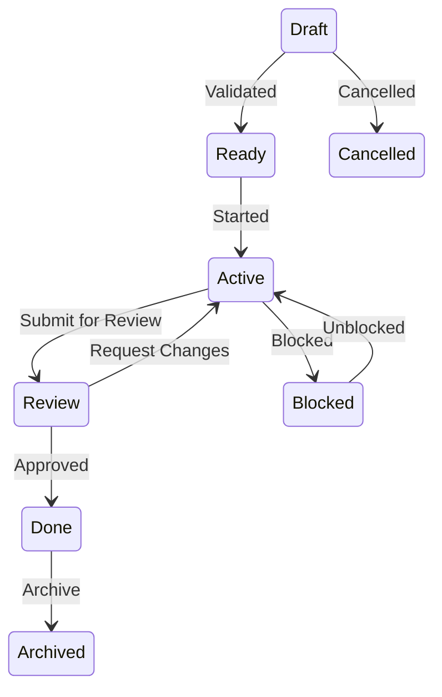

# TaskStatus State Diagram

Auto-generated from `agentpm/core/database/enums/status.py`

## States

- **draft**: DRAFT
- **ready**: READY
- **active**: ACTIVE
- **review**: REVIEW
- **done**: DONE
- **archived**: ARCHIVED
- **blocked**: BLOCKED
- **cancelled**: CANCELLED

## Metadata

- **Enum Class**: `TaskStatus`
- **Total States**: 8
- **Terminal States**: Yes
- **Auto-progression**: Yes

---
*This diagram is auto-generated. Do not edit manually.*