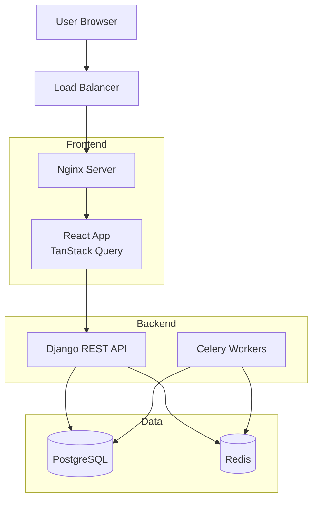

# E-Commerce Platform - System Architecture

## Overview
Fullstack e-commerce platform built with Django REST API backend and React SPA frontend, deployed on Kubernetes.

## System Components

### Backend (Django + PostgreSQL)
- **Framework**: Django 4.2 with Django REST Framework
- **Database**: PostgreSQL 15 (primary data store)
- **Cache/Queue**: Redis (Celery broker, session cache)
- **Async Tasks**: Celery for background processing

### Frontend (React + TypeScript)
- **Framework**: React 18 with TypeScript
- **Build Tool**: Vite (fast HMR, optimized builds)
- **State Management**:
  - TanStack Query (server state)
  - Zustand (UI state)
- **Routing**: TanStack Router (type-safe routing)

### Infrastructure
- **Containerization**: Docker with multi-stage builds
- **Orchestration**: Kubernetes (deployments, services, ingress)
- **Reverse Proxy**: Nginx (static files, API proxy)

## Architecture Diagram (Mermaid)

## Data Flow

### Product Listing Flow
1. User navigates to products page
2. React component triggers TanStack Query hook
3. Axios sends GET /api/products/ with filters
4. Django view queries PostgreSQL
5. Serializes data to JSON
6. Response cached by TanStack Query
7. React renders product cards

### Checkout Flow
1. User adds items to cart (stored in Redux)
2. User clicks checkout
3. POST /api/orders/ with cart data
4. Django validates stock availability
5. Creates Order and OrderItems atomically
6. Triggers Celery task for order confirmation email
7. Returns order number to frontend
8. React redirects to order confirmation page

## Security

### Authentication
- Session-based auth for web (Django sessions)
- JWT tokens for mobile API (future)
- CSRF protection enabled

### Data Protection
- Passwords hashed with Django's PBKDF2
- SQL injection prevention via Django ORM
- XSS prevention via React's built-in escaping
- CORS configured for specific origins

## Scalability

### Horizontal Scaling
- **Frontend**: Stateless containers, scale based on traffic
- **Backend**: Multiple API replicas behind load balancer
- **Database**: PostgreSQL read replicas for queries
- **Celery**: Worker pool scales based on queue depth

### Caching Strategy
- **Browser Cache**: Static assets (1 year TTL)
- **CDN Cache**: Product images, CSS/JS bundles
- **Application Cache**: TanStack Query (5 min stale time)
- **Database Cache**: Redis for session data, Celery results

### Performance Targets
- **API Response**: p95 < 200ms
- **Frontend Load**: First Contentful Paint < 1.5s
- **Database Queries**: N+1 eliminated via select_related
- **Concurrent Users**: 10,000 simultaneous connections

## Deployment

### CI/CD Pipeline
1. Code pushed to GitHub
2. GitHub Actions runs tests (pytest, Jest)
3. Build Docker images for backend/frontend
4. Push images to container registry
5. Update Kubernetes deployments
6. Run database migrations
7. Health check validation

### Environments
- **Development**: docker-compose on local machine
- **Staging**: Kubernetes cluster (2 replicas each)
- **Production**: Kubernetes cluster (3+ replicas, auto-scaling)

## Monitoring

### Metrics
- **Application**: Django Debug Toolbar (dev), Prometheus (prod)
- **Infrastructure**: Kubernetes metrics, Grafana dashboards
- **Frontend**: React DevTools, TanStack Query DevTools
- **Business**: Custom analytics via Analytics app

### Logging
- **Backend**: Django logging to stdout, collected by Fluentd
- **Frontend**: Console errors sent to Sentry
- **Infrastructure**: Kubernetes logs via EFK stack

## Technology Decisions

See ADRs:
- [ADR-001](./adr-001-monorepo-structure.md): Monorepo structure
- [ADR-002](./adr-002-tanstack-over-redux.md): TanStack Query over Redux
